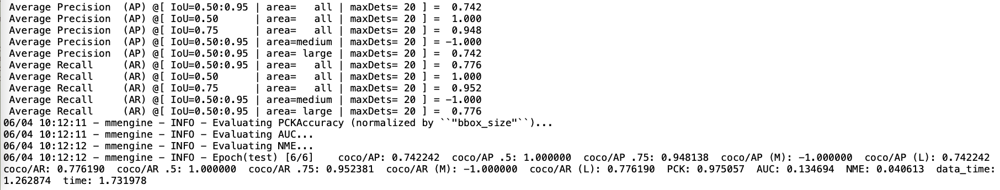
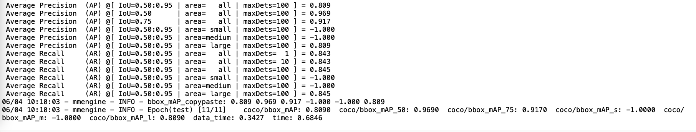

# OpenMMLab_Task

OpenMMLab二期第一次作业

## RTMDet-tiny.txt是使用MMDetection算法库，训练RTMDet耳朵目标检测算法，测试集评估指标

## best_coco_bbox_mAP_epoch_196.pth 是检测最好模型

## RTMPose-s.txt使用MMPose算法库，训练RTMPose耳朵关键点检测算法，测试集评估指标

## best_PCK_epoch_240.pth 是关键点最好模型

